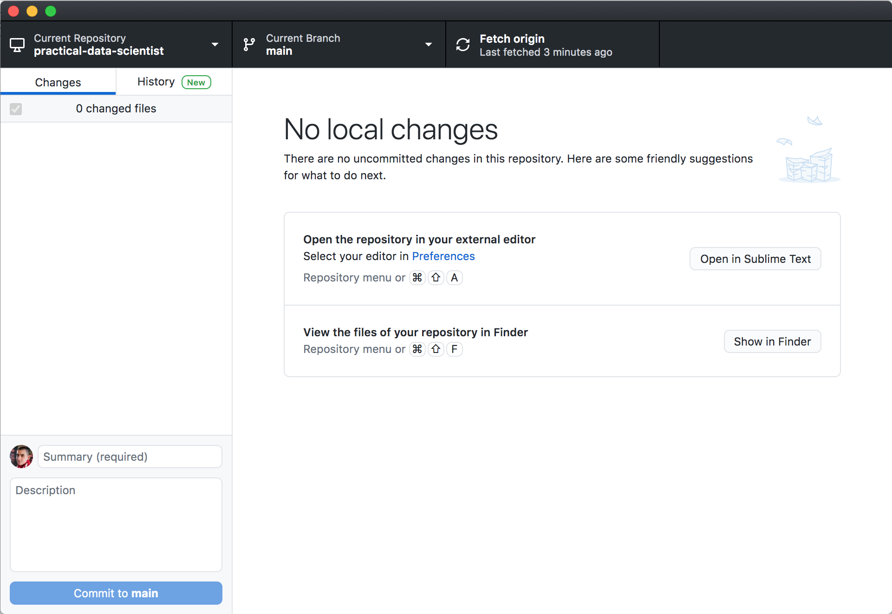
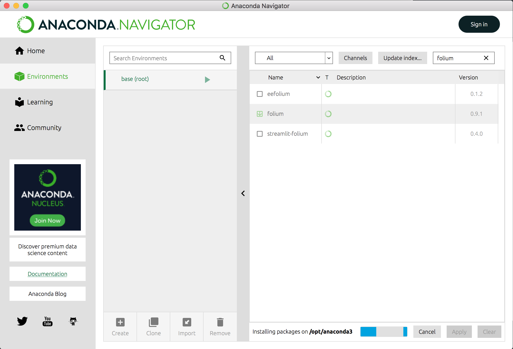
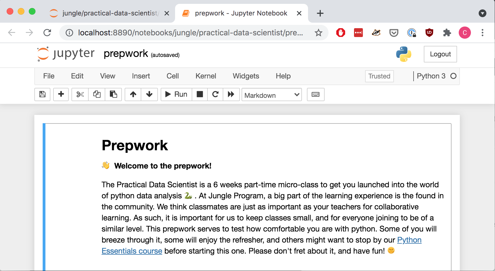

# :building_construction: Workstation Setup

Before starting the Practical Data Scientist course, we must setup your python data analysis workstation. Follow these instructions to install and configure git, python, and jupyter, so that you can run the course notebooks! 🌞

Some operating systems make this step difficult. If you are stuck with the workstation setup, please reach out in the course channel on discord, where the teachers (and other students!) can assist you. :hugs:

## 1 Git

[git](https://git-scm.com/) is a crucial tool for programmers. It facilitates sharing and collaboration of code, files, and resources. All course contents are distributed with `git`, and found in the course repository hosted on [GitHub](https://github.com/JungleProgram/practical-data-scientist).

⏩ _If you are already comfortable with git, please clone the [course repository](https://github.com/JungleProgram/practical-data-scientist) and skip to the Python Environment section._

#### 1.1 Install

* Download & install the [GitHub desktop client](https://desktop.github.com/). 
* Skip the GitHub account registration
* Enter your git information (name & email)

#### 1.2 Cloning

Downloading resources with git is called "cloning". We are effectively copying the course contents from GitHub to your local machine.

* On the `Getting Started` homepage, select `Clone a repository from the internet...`
* Select the `URL` tab and enter `JungleProgram/practical-data-scientist`
* Pick a destination (this is where the course repository will be copied)

Once cloned, you should see `No local changes` in the center of the window, and `Current Repository: practical-data-scientist` in the top left corner as such:

This means you have successfully downloaded the course repository! 🎉

#### 1.3 Pulling

Once in a while, the course repository will be updated on GitHub. You can "pull" those changes to your local repository by clicking the `Fetch origin` button on the top of the course repository window of the GitHub Desktop app.

## 2 Python Environment

Before we start doing fancy things with python 🐍, we've got to install in a way that's easy to use and configure. [Conda](https://docs.conda.io/en/latest/) is a pre-packaged dependency manager for python, and will save us a lot of time with installs and imports. 

ℹ️ _If you are a seasoned developer and don't like conda, this [pyenv+pipenv](https://hackernoon.com/reaching-python-development-nirvana-bb5692adf30c) setup gives more fine-grained control over your python environments. Warning, this install requires unix & bash experience._

#### 2.1 Conda

* Please follow the conda [installation instructions](https://docs.anaconda.com/anaconda/install/). 

#### 2.2 Python Dependencies

This course uses a few libraries that aren't installed with conda by default. The [Anaconda Navigator](https://docs.anaconda.com/anaconda/navigator/getting-started/#navigator-starting-navigator) app allows us to manage our python environments and dependencies.

⏩ _If you are comfortable with the terminal, you can install course dependencies directly with `conda install folium spacy wordcloud -c conda-forge`, and skip to the Jupyter Notebooks section._

We first have to add the [conda-forge](https://conda-forge.org/) [channel](https://docs.conda.io/projects/conda/en/latest/user-guide/concepts/channels.html#what-is-a-conda-channel) to our conda.

* [Open the Anaconda-Navigator app](https://docs.anaconda.com/anaconda/navigator/getting-started/#navigator-starting-navigator) and select the `Environments` tab.
* Under`Channels` -> `Add...`, enter `conda-forge`
* Select `Channels` -> `Update channels`
* Select `Update index...`

Now we have setup the conda-forge channel, we can search and download packages. The course dependencies we need to install are [folium](https://anaconda.org/conda-forge/folium), [spacy](https://anaconda.org/conda-forge/spacy), and [wordcloud](https://anaconda.org/conda-forge/wordcloud). For each:

* Search for the package name in `Search Packages`
* Select the package tickbox
* Select `Apply` then `Apply` again
You should the status: `Installing packages on /opt/anaconda3` at the bottom of the window as such:

Once complete, you have successfully downloaded the course python dependencies! 🎉

## 3 Jupyter Notebooks

[Jupyter](https://jupyter.org/) notebooks are a fundamental tool for data scientists. They are a code shell / text hybrid, hosted on a web server, which  weaves data processing and analysis all in one interactive interface. This web server can be hosted in the [cloud](https://mybinder.org/), or run locally. 

Today, we'll setup a local jupyter notebook server on your machine. Since this is python, `jupyter` is managed by conda, and accessible directly in the [Navigator](https://docs.anaconda.com/anaconda/navigator/)!

#### 3.1 Running the Course Notebook Server
⏩ _If you are comfortable with the terminal, you can open the course jupyter notebook server directly by navigating to the course repository directory, and entering `jupyter notebook`._

* Open the Anaconda-Navigator app and select the `Home` tab.
* Launch the `Jupyter Notebook` application

A window should open in your browser as such:

You have started a jupyter notebook server! 🎉 

#### 3.2 Opening & Running Course Notebooks

I won't write about the basics of notebooks here, since jupyter hosts a wonderful tutorial notebook on [binder](https://mybinder.org/v2/gh/ipython/ipython-in-depth/master?filepath=binder/Index.ipynb).

* Please check out the [Notebook Basics tutorial](https://notebooks.gesis.org/binder/jupyter/user/ipython-ipython-in-depth-qofeqqu6/notebooks/examples/Notebook/Notebook%20Basics.ipynb) to learn how to navigate the server, open, and run notebooks
* Nagivate to the course repository (`practical-data-scientist`). You should find it where you cloned it with GitHub Desktop.
* Under `prepwork`, open `prepwork.ipynb`

The prepwork notebook should open in a new tab in your browser as such:

Congratulations, you are now running local jupyter notebooks, and are ready to start the course! 🎉🎉

#### 3.3 Editing & Saving Course Notebooks

Throughout the course, you might want to edit or add to some of the course notebooks and save those changes. However, **this might lead to conflicts with the notebooks hosted in GitHub**. Since no one likes to [resolve merge conflicts](https://www.atlassian.com/git/tutorials/using-branches/merge-conflicts), it is recommended to **make a copy of the notebook** before editing and saving it.

* Open the notebook in question
* Select `File` -> `Make a Copy...`

You should now have a new notebook named `XXXXX-Copy1`. This copy is safe to edit and save, and will not conflict with the notebooks hosted on GitHub.

# Resources

### Core Resources

- [**Course Materials - GitHub Repository**](https://github.com/camille-vanhoffelen/practical-data-scientist) 
- [jupyter notebook tutorial](https://mybinder.org/v2/gh/ipython/ipython-in-depth/master?filepath=binder/Index.ipynb)

### Additional Resources

#### GitHub Desktop Client

- [Configuration](https://docs.github.com/en/desktop/installing-and-configuring-github-desktop/overview/getting-started-with-github-desktop)
- [Cloning](https://docs.github.com/en/desktop/contributing-and-collaborating-using-github-desktop/adding-and-cloning-repositories/cloning-and-forking-repositories-from-github-desktop)
- [Pulling](https://docs.github.com/en/desktop/contributing-and-collaborating-using-github-desktop/keeping-your-local-repository-in-sync-with-github/syncing-your-branch#pulling-to-your-local-branch-from-the-remote)
- [Introduction to git](https://guides.github.com/introduction/git-handbook/)  

#### Conda

- [Install](https://docs.anaconda.com/anaconda/install/)
- [Anaconda Navigator](https://docs.anaconda.com/anaconda/navigator/getting-started/#navigator-starting-navigator)
- [Navigator - Managing packages](https://docs.anaconda.com/anaconda/navigator/tutorials/manage-packages/)
- [CLI - Managing packages](https://conda.io/projects/conda/en/latest/user-guide/getting-started.html#managing-packages)
- [Navigator - conda-forge](https://conda-forge.org/docs/user/introduction.html#display-conda-forge-packages-in-anaconda-navigator)

#### Jupyter

- [Jupyter Notebook Features](http://arogozhnikov.github.io/2016/09/10/jupyter-features.html)  
- [Jupyter Themes](https://github.com/dunovank/jupyter-themes)  